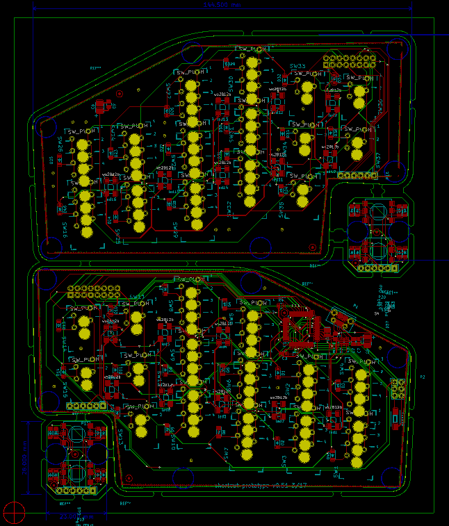

Shortcut v4 schematic and board layout. This is the version that
[Dygma](http://www.dygma.com) used for conducting closed beta testing of the
shortcut gaming keyboard.

[Schematic PDF](schematic.pdf)

Copyright Dygma 2017.

The firmware for the keyboard is part of the [Kaleidoscope
project](https://github.com/keyboardio/Kaleidoscope). The
specific implementation is defined in the [Shortcut Hardware
Plugin](https://github.com/Dygmalab/Kaleidoscope-Hardware-Shortcut).

This documentation describes Open Hardware and is licensed under the
[CERN OHL v. 1.2.](cern_ohl_v_1_2.txt)

You may redistribute and modify this documentation under the terms of the
CERN OHL v.1.2. (http://ohwr.org/cernohl). This documentation is distributed
WITHOUT ANY EXPRESS OR IMPLIED WARRANTY, INCLUDING OF
MERCHANTABILITY, SATISFACTORY QUALITY AND FITNESS FOR A
PARTICULAR PURPOSE. Please see the CERN OHL v.1.2 for applicable
conditions
